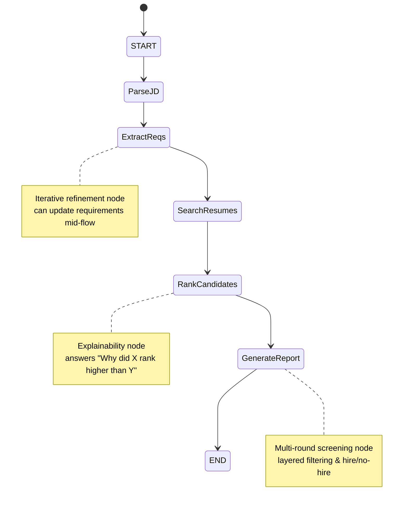

# Resume RAG Project – Matching Agent

##  Learning Objectives
- **Understand LangGraph agent design**: Build a state machine workflow for parsing job descriptions and matching resumes.
- **Apply RAG (Retrieval-Augmented Generation)**: Use resume data to shortlist and rank candidates.
- **Develop explainable AI features**: Provide reasoning, strengths/gaps, and improvement suggestions for candidates.
- **Enable interactive refinement**: Allow users to adjust requirements mid‑conversation.
- **Demonstrate advanced screening**: Multi‑round filtering with hire/no‑hire recommendations.


##  Architecture
The agent workflow is modeled as a **LangGraph state machine**:



Additional nodes:
- **Comparison** → Head‑to‑head candidate analysis  
- **Strengths & Gaps** → Highlight skills and missing areas  
- **Improvement Suggestions** → Tailored advice for borderline candidates  

---

## 📄 Output Format
- **JSON reports** for candidate shortlists and rankings
- **CLI text outputs** for explanations, comparisons, and suggestions
- **PDF diagram** (`Mermaid Flow Flow-2026-08-15-135717.pdf`) for architecture visualization

---

## 📂 Folder Structure
```
resume_rag_project/
│
├── scripts/
│   └── matching_agent.py        # Main agent implementation
│
├── chroma_db/                   # Resume embeddings (ignored in .gitignore)
│
├── Mermaid Flow Flow-2026-08-15-135717.pdf   # State machine diagram
├── state_machine_diagram.md     # Mermaid source diagram
├── resume_rag_project.mp4       # Demo video (5–6 minutes)
├── requirements.txt             # Dependencies
├── README.md                    # Project documentation
└── .gitignore                   # Excluded files/folders
```

---

## ▶️ Usage
1. Clone the repo:
   ```bash
   git clone https://github.com/Niha2048/resume_rag_project.git
   cd resume_rag_project
   ```
2. Create virtual environment:
   ```bash
   python -m venv venv
   venv\Scripts\activate   # Windows
   ```
3. Install dependencies:
   ```bash
   pip install -r requirements.txt
   ```
4. Run the agent:
   ```bash
   python scripts/matching_agent.py
   ```

### Example Queries
- `Find me candidates with Java and 3+ years experience`
- `Add AWS`
- `Why did Erri_Teja_Kumar rank higher than Ashwini_Rao`
- `Run multi-round screening`
- `Compare Ashwini_Rao Erri_Teja_Kumar`
- `Show strengths and gaps`
- `Suggest improvements for candidates`

---

## 📦 Deliverables
- ✅ LangGraph agent implementation (`matching_agent.py`)
- ✅ State machine diagram (Mermaid + PDF)
- ✅ CLI interface
---

## 🔮 Future Enhancements
- **Web UI**: Streamlit/Gradio interface for easier interaction
- **Resume ingestion**: Upload and parse real resumes (PDF/DOCX)
- **Advanced RAG search**: Semantic similarity with embeddings
- **Interview question generation**: Automated screening questions per candidate
- **Integration with ATS**: Connect to Applicant Tracking Systems for real‑world use

---

